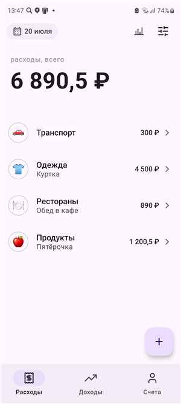
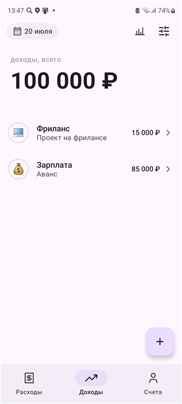
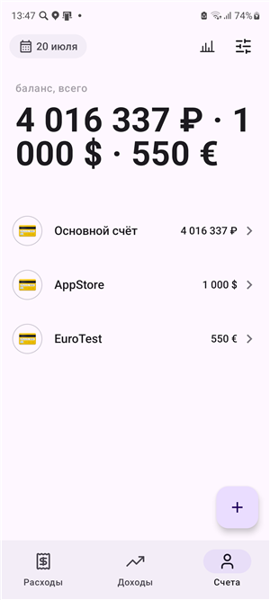
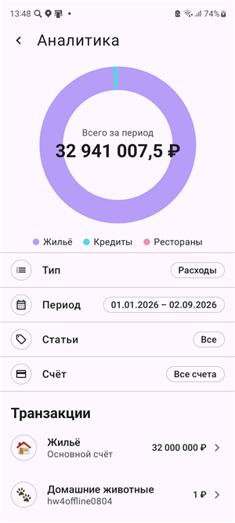
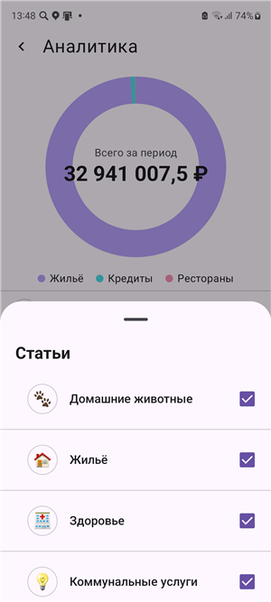
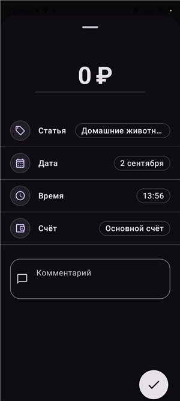
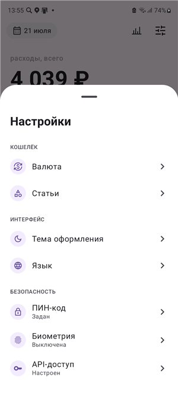
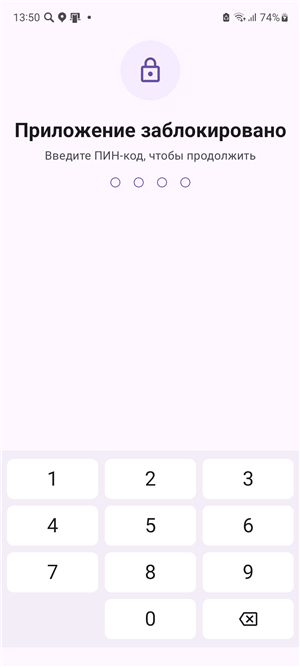
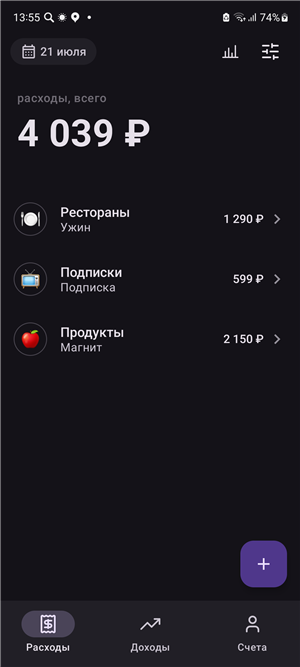

# SHMR Finance

Android-приложение для учёта личных финансов: доходы и расходы, счета в разных валютах и аналитика трат по категориям.


Приложение работает офлайн: данные лежат в локальной базе, изменения складываются в очередь синхронизации и уезжают на сервер, когда появляется сеть. Вход защищён ПИН-кодом и биометрией, интерфейс переведён на пять языков и поддерживает светлую и тёмную темы.

---

## Скриншоты

| Расходы | Доходы | Счета |
|:---:|:---:|:---:|
|  |  |  |
| Операции за период с итоговой суммой | Тот же экран для доходов | Мультивалютные счета: ₽, $, € |

| Аналитика | Фильтры | Редактор операции |
|:---:|:---:|:---:|
|  |  |  |
| Диаграмма трат по категориям | Выбор статей и периода | Сумма, статья, дата, время, счёт |

| Настройки | Блокировка | Тёмная тема |
|:---:|:---:|:---:|
|  |  |  |
| Валюта, статьи, тема, язык, безопасность | ПИН-код на входе в приложение | Полноценная тёмная тема |

---

## Возможности

**Учёт операций.** Доходы и расходы с категорией, счётом, датой, временем и комментарием. Список за выбранный период с итоговой суммой в шапке.

**Счета.** Несколько счетов одновременно, каждый в своей валюте (₽, $, €). Общий баланс показывается по каждой валюте отдельно — без выдуманных курсов конвертации.

**Аналитика.** Кольцевая диаграмма по категориям, выбор периода (неделя, месяц, квартал, год или произвольный диапазон) и фильтры по статьям и счетам. Ошибки сети показываются снекбаром с повтором, а не затирают уже загруженные данные.

**Работа офлайн.** Экраны читают данные из локальной базы, поэтому открываются без сети. Правки пишутся в очередь синхронизации и отправляются на сервер фоновой задачей, когда связь появляется.

**Безопасность.** Сам ПИН-код не сохраняется нигде: на диск ложится только проверочная запись PBKDF2 (соль и хеш), которая дополнительно шифруется ключом из Android Keystore и уже в таком виде кладётся в `EncryptedSharedPreferences`. Четыре цифры — это всего 10 000 комбинаций, поэтому одной KDF мало: основную защиту даёт ключ Keystore, а PBKDF2 работает вторым эшелоном на случай его утечки. Поддерживается вход по биометрии. Токен API вводится в настройках и хранится зашифрованным тем же ключом.

**Интерфейс.** Material 3, светлая и тёмная темы (плюс режим «системная»), локализация на русский, английский, немецкий, испанский и французский.

---

## Архитектура

Один Gradle-модуль `:app`, разделённый по слоям — зависимости направлены только внутрь, к `domain`:

```
ui      Compose-экраны, ViewModel'и, навигация
  │  зависит от
  ▼
domain  модели, интерфейсы репозиториев, валидация
  ▲
  │  реализует интерфейсы
data    Room, Retrofit, мапперы, синхронизация, шифрование
```

`domain` не знает ни про Android, ни про сеть, ни про базу: он объявляет интерфейсы репозиториев, а `data` их реализует.

**Состояние экранов.** Вместо россыпи флагов `isLoading` / `error` экраны рендерят одно запечатанное состояние `UiState<T>` — `Loading` / `Content` / `Empty` / `Error`. Благодаря этому невозможно случайно показать спиннер и ошибку одновременно.

**MVI на аналитике.** Самый сложный экран собран явным контрактом: `AnalyticsState` / `AnalyticsAction` / `AnalyticsEffect`. ViewModel сводит действия к состоянию, композаблы остаются без собственного состояния, разовые события (снекбар) уходят отдельным каналом эффектов.

**Ошибки.** Все сетевые вызовы проходят через `safeApiCall`, который переводит исключения и HTTP-коды в `AppResult<T>`: 401 → `Unauthorized`, 5xx → `Server`, `IOException` → `NoInternet`. Выше по стеку никто не ловит исключения руками.

**Внедрение зависимостей.** DI-фреймворка нет — граф собран вручную в `ServiceLocator` с ленивой инициализацией. Для проекта такого размера это осознанный выбор: меньше магии и нулевое время сборки на кодогенерацию.

**Навигация.** `NavHost` двухуровневый намеренно: `Scaffold` с нижней навигацией и FAB живёт внутри destination с вкладками, а не оборачивает весь граф. Иначе при переходе в аналитику панели исчезали бы из-под уходящего экрана прямо во время анимации.

### Синхронизация

Каждая локальная запись хранит `revision` и действие (`CREATE` / `UPDATE`). `SyncEngine` разбирает очередь, отправляет накопленные изменения через `RemoteSyncGateway` и раскладывает результат обратно в базу. Постоянные ошибки (например, отвергнутая сервером запись) помечаются отдельно, чтобы одна битая операция не блокировала всю очередь. Запуск в фоне — на `WorkManager`.

---

## Стек

| Слой | Технологии |
|---|---|
| Язык | Kotlin 2.0.21, корутины 1.9.0, JVM 17, core library desugaring |
| UI | Jetpack Compose (BOM 2024.09.03), Material 3, Navigation Compose, Core SplashScreen |
| Сеть | Retrofit 2.11, OkHttp 4.12, kotlinx.serialization 1.7.3 |
| Хранение | Room 2.6.1 (KSP, миграции), DataStore Preferences 1.1.1 |
| Фон | WorkManager 2.9.1 |
| Безопасность | androidx.security-crypto, androidx.biometric, Android Keystore |
| Тесты | JUnit4, MockWebServer, androidx.test |

Сборка релиза идёт с включёнными R8 и `shrinkResources`.

---

## Тесты

```
app/src/test         149 unit-тестов
app/src/androidTest    24 инструментальных теста
```

Покрыты форматирование и парсинг денег, разбор дат API (RFC3339 с микросекундами), логика повторов в `RetryInterceptor`, редьюсеры ViewModel'ей, валидация форм, шифрование ПИН-кода и миграции Room.

```bash
./gradlew testDebugUnitTest
```

Инструментальные тесты требуют подключённого устройства или эмулятора:

```bash
./gradlew connectedDebugAndroidTest
```

---

## Сборка и запуск

Нужны JDK 17 и Android SDK 36.

```bash
git clone https://github.com/mikhail0vvlad/FinanceApp.git
cd FinanceApp
```

Приложение работает с учебным REST-бэкендом и требует персональный токен. Есть два способа его задать:

1. **Через интерфейс** — запустить приложение и вписать токен в «Настройки → API-доступ». Токен сохранится в зашифрованном хранилище.
2. **Через сборку** — добавить в `local.properties` в корне проекта:

   ```properties
   API_TOKEN=ваш_токен
   ```

   При необходимости там же переопределяется адрес API (по умолчанию `https://shmr-finance.ru/api/v1/`):

   ```properties
   API_BASE_URL=https://your-host/api/v1/
   ```

Файл `local.properties` в репозиторий не попадает.

```bash
./gradlew assembleDebug
./gradlew installDebug
```

На Windows — `gradlew.bat` вместо `./gradlew`.

Если у токена ещё нет ни одного счёта, экраны данных будут пустыми — это не ошибка, нужно создать счёт и несколько операций.

---

## Структура проекта

```
app/src/main/java/ru/shmr/finance/
├── core/          UiState, AppResult, диспетчеры корутин
├── data/
│   ├── local/     Room: сущности, DAO, источники данных, очередь синхронизации
│   ├── network/   Retrofit API, DTO, интерцепторы, safeApiCall
│   ├── mapper/    DTO ↔ доменные модели
│   ├── repository/ реализации репозиториев
│   ├── security/  ПИН, биометрия, Keystore, хранение токена
│   ├── settings/  DataStore
│   └── sync/      SyncEngine, оркестратор, планировщик на WorkManager
├── di/            ServiceLocator
├── domain/        модели, интерфейсы репозиториев, валидация
└── ui/
    ├── components/ переиспользуемые composable-элементы
    ├── lock/      экран блокировки
    ├── screens/   расходы, доходы, счета, аналитика, редакторы, настройки
    ├── splash/    анимированный сплэш
    └── theme/     Material 3 тема
```

---

## О проекте

Написано в рамках Школы мобильной разработки Яндекса как серия из четырёх домашних заданий: базовые экраны на Compose → работа с сетью → экран аналитики → архитектура, локальное хранилище и качество кода. Бэкенд — учебный, предоставленный курсом; данные на скриншотах тестовые.

## Лицензия

[MIT](LICENSE)
